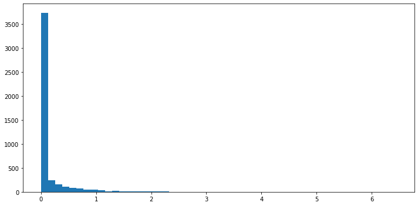

```python
import pandas as pd

```


```python
df = pd.read_json('rdu-weather-history.json')
```


```python
df
```


<div>
<style scoped>
    .dataframe tbody tr th:only-of-type {
        vertical-align: middle;
    }

    .dataframe tbody tr th {
        vertical-align: top;
    }

    .dataframe thead th {
        text-align: right;
    }
</style>
<table border="1" class="dataframe">
  <thead>
    <tr style="text-align: right;">
      <th></th>
      <th>fogground</th>
      <th>snowfall</th>
      <th>dust</th>
      <th>snowdepth</th>
      <th>mist</th>
      <th>drizzle</th>
      <th>hail</th>
      <th>fastest2minwindspeed</th>
      <th>thunder</th>
      <th>glaze</th>
      <th>...</th>
      <th>freezingrain</th>
      <th>rain</th>
      <th>highwind</th>
      <th>date</th>
      <th>precipitation</th>
      <th>fogheavy</th>
      <th>smokehaze</th>
      <th>avgwindspeed</th>
      <th>fastest2minwinddir</th>
      <th>fastest5secwinddir</th>
    </tr>
  </thead>
  <tbody>
    <tr>
      <td>0</td>
      <td>No</td>
      <td>0.0</td>
      <td>No</td>
      <td>0.0</td>
      <td>Yes</td>
      <td>Yes</td>
      <td>No</td>
      <td>14.09</td>
      <td>No</td>
      <td>No</td>
      <td>...</td>
      <td>No</td>
      <td>Yes</td>
      <td>No</td>
      <td>2009-10-06</td>
      <td>0.02</td>
      <td>No</td>
      <td>Yes</td>
      <td>3.80</td>
      <td>240.0</td>
      <td>230.0</td>
    </tr>
    <tr>
      <td>1</td>
      <td>No</td>
      <td>0.0</td>
      <td>No</td>
      <td>0.0</td>
      <td>No</td>
      <td>No</td>
      <td>No</td>
      <td>17.90</td>
      <td>No</td>
      <td>No</td>
      <td>...</td>
      <td>No</td>
      <td>No</td>
      <td>No</td>
      <td>2009-10-09</td>
      <td>0.00</td>
      <td>No</td>
      <td>No</td>
      <td>10.29</td>
      <td>220.0</td>
      <td>210.0</td>
    </tr>
    <tr>
      <td>2</td>
      <td>No</td>
      <td>0.0</td>
      <td>No</td>
      <td>0.0</td>
      <td>Yes</td>
      <td>No</td>
      <td>Yes</td>
      <td>10.07</td>
      <td>No</td>
      <td>No</td>
      <td>...</td>
      <td>No</td>
      <td>Yes</td>
      <td>No</td>
      <td>2009-10-12</td>
      <td>0.19</td>
      <td>Yes</td>
      <td>No</td>
      <td>5.14</td>
      <td>150.0</td>
      <td>340.0</td>
    </tr>
    <tr>
      <td>3</td>
      <td>No</td>
      <td>0.0</td>
      <td>No</td>
      <td>0.0</td>
      <td>No</td>
      <td>No</td>
      <td>No</td>
      <td>12.97</td>
      <td>No</td>
      <td>No</td>
      <td>...</td>
      <td>No</td>
      <td>No</td>
      <td>No</td>
      <td>2009-10-19</td>
      <td>0.00</td>
      <td>No</td>
      <td>No</td>
      <td>2.01</td>
      <td>30.0</td>
      <td>80.0</td>
    </tr>
    <tr>
      <td>4</td>
      <td>No</td>
      <td>0.0</td>
      <td>No</td>
      <td>0.0</td>
      <td>Yes</td>
      <td>Yes</td>
      <td>Yes</td>
      <td>14.09</td>
      <td>No</td>
      <td>No</td>
      <td>...</td>
      <td>No</td>
      <td>Yes</td>
      <td>No</td>
      <td>2009-10-26</td>
      <td>0.06</td>
      <td>No</td>
      <td>No</td>
      <td>5.82</td>
      <td>40.0</td>
      <td>50.0</td>
    </tr>
    <tr>
      <td>...</td>
      <td>...</td>
      <td>...</td>
      <td>...</td>
      <td>...</td>
      <td>...</td>
      <td>...</td>
      <td>...</td>
      <td>...</td>
      <td>...</td>
      <td>...</td>
      <td>...</td>
      <td>...</td>
      <td>...</td>
      <td>...</td>
      <td>...</td>
      <td>...</td>
      <td>...</td>
      <td>...</td>
      <td>...</td>
      <td>...</td>
      <td>...</td>
    </tr>
    <tr>
      <td>4634</td>
      <td>No</td>
      <td>0.0</td>
      <td>No</td>
      <td>0.0</td>
      <td>Yes</td>
      <td>No</td>
      <td>No</td>
      <td>14.09</td>
      <td>No</td>
      <td>No</td>
      <td>...</td>
      <td>No</td>
      <td>No</td>
      <td>No</td>
      <td>2009-08-07</td>
      <td>0.00</td>
      <td>No</td>
      <td>Yes</td>
      <td>3.36</td>
      <td>180.0</td>
      <td>180.0</td>
    </tr>
    <tr>
      <td>4635</td>
      <td>No</td>
      <td>0.0</td>
      <td>No</td>
      <td>0.0</td>
      <td>Yes</td>
      <td>No</td>
      <td>Yes</td>
      <td>16.11</td>
      <td>Yes</td>
      <td>No</td>
      <td>...</td>
      <td>No</td>
      <td>Yes</td>
      <td>No</td>
      <td>2009-08-16</td>
      <td>0.08</td>
      <td>No</td>
      <td>No</td>
      <td>2.01</td>
      <td>170.0</td>
      <td>170.0</td>
    </tr>
    <tr>
      <td>4636</td>
      <td>No</td>
      <td>0.0</td>
      <td>No</td>
      <td>0.0</td>
      <td>No</td>
      <td>No</td>
      <td>No</td>
      <td>12.08</td>
      <td>No</td>
      <td>No</td>
      <td>...</td>
      <td>No</td>
      <td>No</td>
      <td>No</td>
      <td>2009-09-04</td>
      <td>0.00</td>
      <td>No</td>
      <td>No</td>
      <td>2.91</td>
      <td>50.0</td>
      <td>20.0</td>
    </tr>
    <tr>
      <td>4637</td>
      <td>No</td>
      <td>0.0</td>
      <td>No</td>
      <td>0.0</td>
      <td>No</td>
      <td>No</td>
      <td>No</td>
      <td>12.08</td>
      <td>No</td>
      <td>No</td>
      <td>...</td>
      <td>No</td>
      <td>No</td>
      <td>No</td>
      <td>2009-09-11</td>
      <td>0.00</td>
      <td>No</td>
      <td>No</td>
      <td>2.91</td>
      <td>280.0</td>
      <td>70.0</td>
    </tr>
    <tr>
      <td>4638</td>
      <td>No</td>
      <td>0.0</td>
      <td>No</td>
      <td>0.0</td>
      <td>Yes</td>
      <td>No</td>
      <td>Yes</td>
      <td>14.09</td>
      <td>No</td>
      <td>No</td>
      <td>...</td>
      <td>No</td>
      <td>Yes</td>
      <td>No</td>
      <td>2009-09-16</td>
      <td>0.05</td>
      <td>No</td>
      <td>No</td>
      <td>4.70</td>
      <td>40.0</td>
      <td>40.0</td>
    </tr>
  </tbody>
</table>
<p>4639 rows × 28 columns</p>
</div>


```python
import pandas as pd
import numpy as np
import matplotlib.pyplot as plt
%matplotlib inline
```


```python
plt.figure(figsize=(10, 5))
plt.hist(df["precipitation"], bins=50)
plt.tight_layout()
plt.show()
```





```python

```
